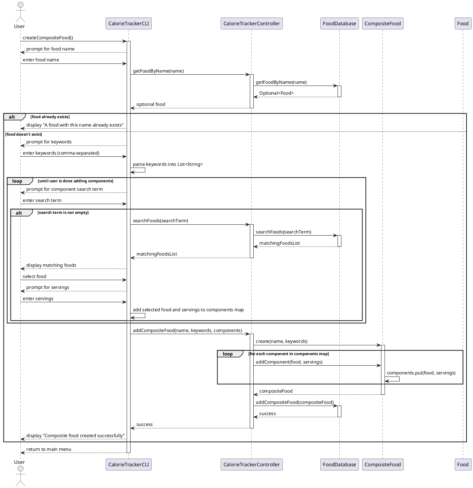
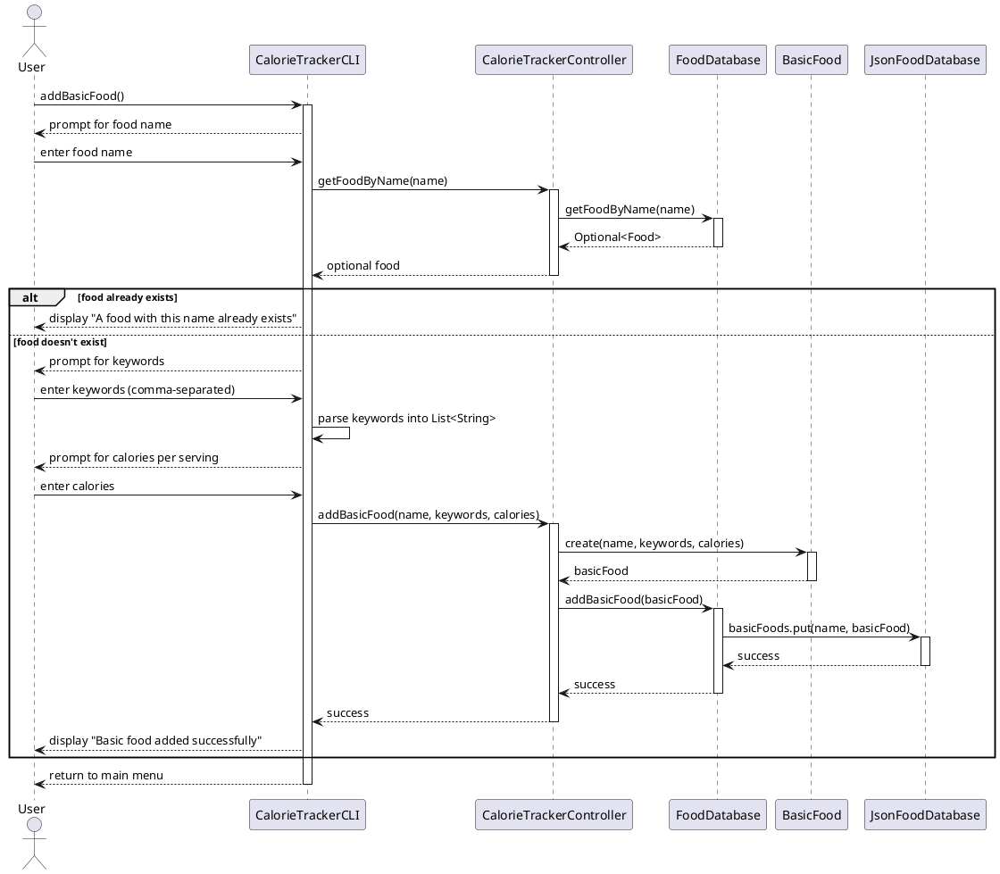
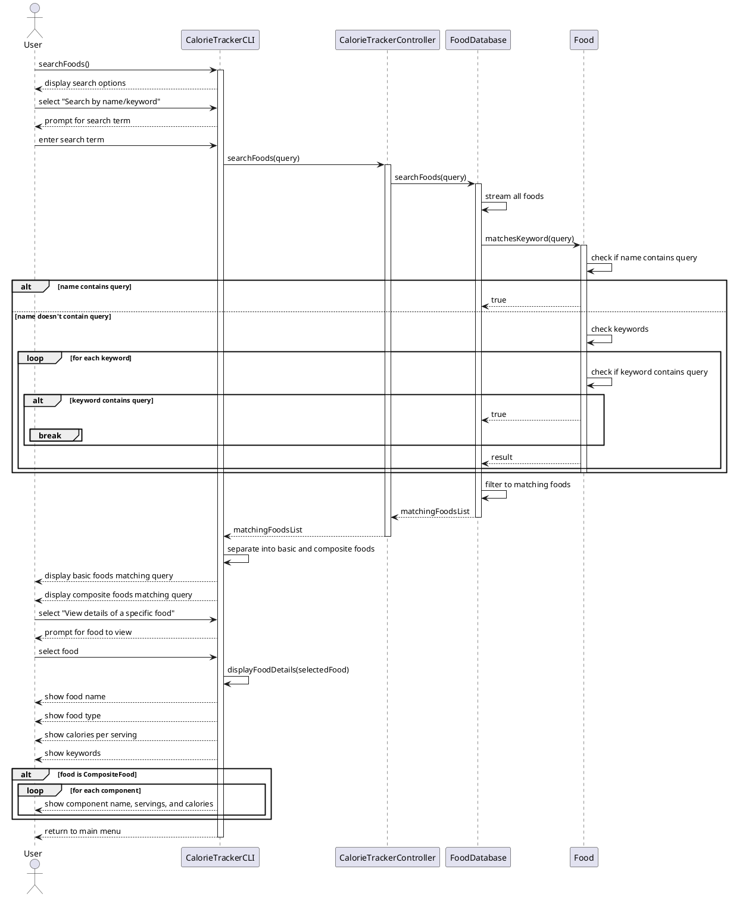
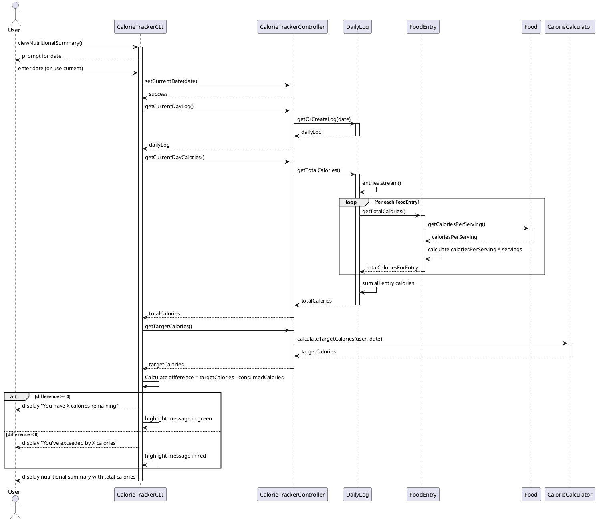

## 1. User Creates Composite Food from Basic Foods

```puml
@startuml
actor User
participant "CalorieTrackerCLI" as CLI
participant "CalorieTrackerController" as Controller
participant "FoodDatabase" as FoodDB
participant "CompositeFood" as CompositeFood
participant "Food" as Food

User -> CLI: createCompositeFood()
activate CLI

CLI --> User: prompt for food name
User -> CLI: enter food name

CLI -> Controller: getFoodByName(name)
activate Controller
Controller -> FoodDB: getFoodByName(name)
activate FoodDB
FoodDB --> Controller: Optional<Food>
deactivate FoodDB
Controller --> CLI: optional food
deactivate Controller

alt food already exists
    CLI --> User: display "A food with this name already exists"
else food doesn't exist
    CLI --> User: prompt for keywords
    User -> CLI: enter keywords (comma-separated)
    
    CLI -> CLI: parse keywords into List<String>
    
    ' Add components loop
    loop until user is done adding components
        CLI --> User: prompt for component search term
        User -> CLI: enter search term
        
        alt search term is not empty
            CLI -> Controller: searchFoods(searchTerm)
            activate Controller
            Controller -> FoodDB: searchFoods(searchTerm)
            activate FoodDB
            FoodDB --> Controller: matchingFoodsList
            deactivate FoodDB
            Controller --> CLI: matchingFoodsList
            deactivate Controller
            
            CLI --> User: display matching foods
            User -> CLI: select food
            CLI --> User: prompt for servings
            User -> CLI: enter servings
            
            CLI -> CLI: add selected food and servings to components map
        end
    end
    
    CLI -> Controller: addCompositeFood(name, keywords, components)
    activate Controller
    
    Controller -> CompositeFood: create(name, keywords)
    activate CompositeFood
    
    loop for each component in components map
        Controller -> CompositeFood: addComponent(food, servings)
        CompositeFood -> CompositeFood: components.put(food, servings)
    end
    
    CompositeFood --> Controller: compositeFood
    deactivate CompositeFood
    
    Controller -> FoodDB: addCompositeFood(compositeFood)
    activate FoodDB
    FoodDB --> Controller: success
    deactivate FoodDB
    
    Controller --> CLI: success
    deactivate Controller
    
    CLI --> User: display "Composite food created successfully"
end

CLI --> User: return to main menu
deactivate CLI
@enduml
```

## 2. User Adds New Basic Food

```puml
@startuml
actor User
participant "CalorieTrackerCLI" as CLI
participant "CalorieTrackerController" as Controller
participant "FoodDatabase" as FoodDB
participant "BasicFood" as BasicFood

User -> CLI: addBasicFood()
activate CLI

CLI --> User: prompt for food name
User -> CLI: enter food name

CLI -> Controller: getFoodByName(name)
activate Controller
Controller -> FoodDB: getFoodByName(name)
activate FoodDB
FoodDB --> Controller: Optional<Food>
deactivate FoodDB
Controller --> CLI: optional food
deactivate Controller

alt food already exists
    CLI --> User: display "A food with this name already exists"
else food doesn't exist
    CLI --> User: prompt for keywords
    User -> CLI: enter keywords (comma-separated)
    
    CLI -> CLI: parse keywords into List<String>
    
    CLI --> User: prompt for calories per serving
    User -> CLI: enter calories
    
    CLI -> Controller: addBasicFood(name, keywords, calories)
    activate Controller
    
    Controller -> BasicFood: create(name, keywords, calories)
    activate BasicFood
    BasicFood --> Controller: basicFood
    deactivate BasicFood
    
    Controller -> FoodDB: addBasicFood(basicFood)
    activate FoodDB
    FoodDB -> JsonFoodDatabase: basicFoods.put(name, basicFood)
    activate JsonFoodDatabase
    JsonFoodDatabase --> FoodDB: success
    deactivate JsonFoodDatabase
    FoodDB --> Controller: success
    deactivate FoodDB
    
    Controller --> CLI: success
    deactivate Controller
    
    CLI --> User: display "Basic food added successfully"
end

CLI --> User: return to main menu
deactivate CLI
@enduml
```

## 3. User Searches for Foods and Views Information

```puml
@startuml
actor User
participant "CalorieTrackerCLI" as CLI
participant "CalorieTrackerController" as Controller
participant "FoodDatabase" as FoodDB
participant "Food" as Food

User -> CLI: searchFoods()
activate CLI

CLI --> User: display search options
User -> CLI: select "Search by name/keyword"
CLI --> User: prompt for search term
User -> CLI: enter search term

CLI -> Controller: searchFoods(query)
activate Controller

Controller -> FoodDB: searchFoods(query)
activate FoodDB

FoodDB -> FoodDB: stream all foods
loop for each Food item
    FoodDB -> Food: matchesKeyword(query)
    activate Food
    
    Food -> Food: check if name contains query
    alt name contains query
        Food --> FoodDB: true
    else name doesn't contain query
        Food -> Food: check keywords
        loop for each keyword
            Food -> Food: check if keyword contains query
            alt keyword contains query
                Food --> FoodDB: true
                break
            end
        end
        Food --> FoodDB: result
    end
    deactivate Food
end

FoodDB -> FoodDB: filter to matching foods
FoodDB --> Controller: matchingFoodsList
deactivate FoodDB

Controller --> CLI: matchingFoodsList
deactivate Controller

CLI -> CLI: separate into basic and composite foods

CLI --> User: display basic foods matching query
CLI --> User: display composite foods matching query

User -> CLI: select "View details of a specific food"
CLI --> User: prompt for food to view
User -> CLI: select food

CLI -> CLI: displayFoodDetails(selectedFood)
CLI --> User: show food name
CLI --> User: show food type
CLI --> User: show calories per serving
CLI --> User: show keywords

alt food is CompositeFood
    loop for each component
        CLI --> User: show component name, servings, and calories
    end
end

CLI --> User: return to main menu
deactivate CLI
@enduml
```

## 4. User Determines Total Calories Consumed

```puml
@startuml
actor User
participant "CalorieTrackerCLI" as CLI
participant "CalorieTrackerController" as Controller
participant "DailyLog" as DailyLog
participant "FoodEntry" as FoodEntry
participant "Food" as Food
participant "CalorieCalculator" as Calculator

User -> CLI: viewNutritionalSummary()
activate CLI

CLI --> User: prompt for date
User -> CLI: enter date (or use current)

CLI -> Controller: setCurrentDate(date)
activate Controller
Controller --> CLI: success
deactivate Controller

CLI -> Controller: getCurrentDayLog()
activate Controller
Controller -> DailyLog: getOrCreateLog(date)
activate DailyLog
DailyLog --> Controller: dailyLog
deactivate DailyLog
Controller --> CLI: dailyLog
deactivate Controller

CLI -> Controller: getCurrentDayCalories()
activate Controller
Controller -> DailyLog: getTotalCalories()
activate DailyLog

DailyLog -> DailyLog: entries.stream()
loop for each FoodEntry
    DailyLog -> FoodEntry: getTotalCalories()
    activate FoodEntry
    
    FoodEntry -> Food: getCaloriesPerServing()
    activate Food
    Food --> FoodEntry: caloriesPerServing
    deactivate Food
    
    FoodEntry -> FoodEntry: calculate caloriesPerServing * servings
    FoodEntry --> DailyLog: totalCaloriesForEntry
    deactivate FoodEntry
end

DailyLog -> DailyLog: sum all entry calories
DailyLog --> Controller: totalCalories
deactivate DailyLog

Controller --> CLI: totalCalories
deactivate Controller

CLI -> Controller: getTargetCalories()
activate Controller
Controller -> Calculator: calculateTargetCalories(user, date)
activate Calculator
Calculator --> Controller: targetCalories
deactivate Calculator
Controller --> CLI: targetCalories
deactivate Controller

CLI -> CLI: Calculate difference = targetCalories - consumedCalories

alt difference >= 0
    CLI --> User: display "You have X calories remaining"
    CLI -> CLI: highlight message in green
else difference < 0
    CLI --> User: display "You've exceeded by X calories"
    CLI -> CLI: highlight message in red
end

CLI --> User: display nutritional summary with total calories
deactivate CLI
@enduml
```
